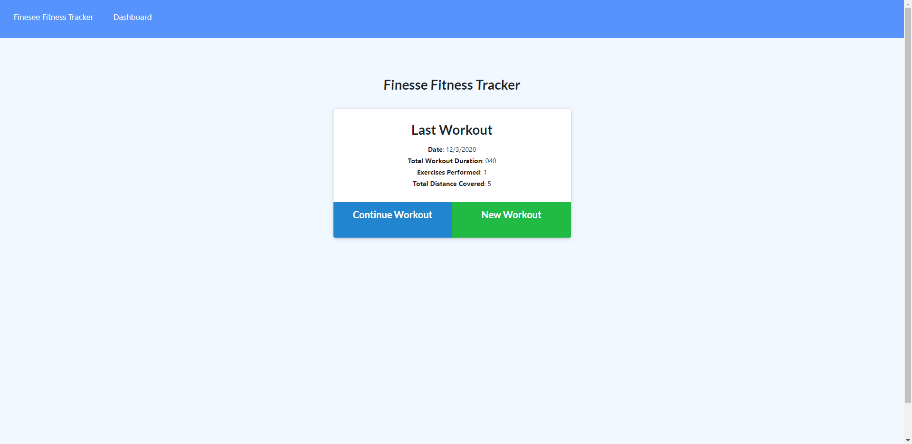
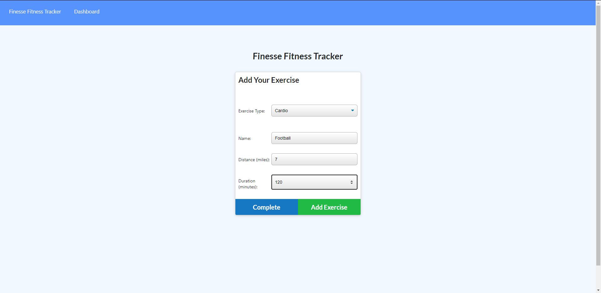
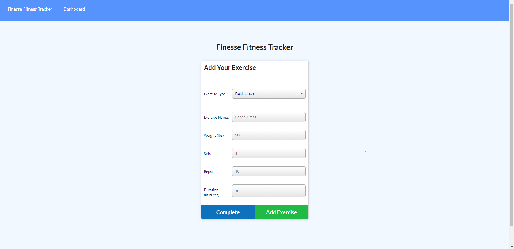
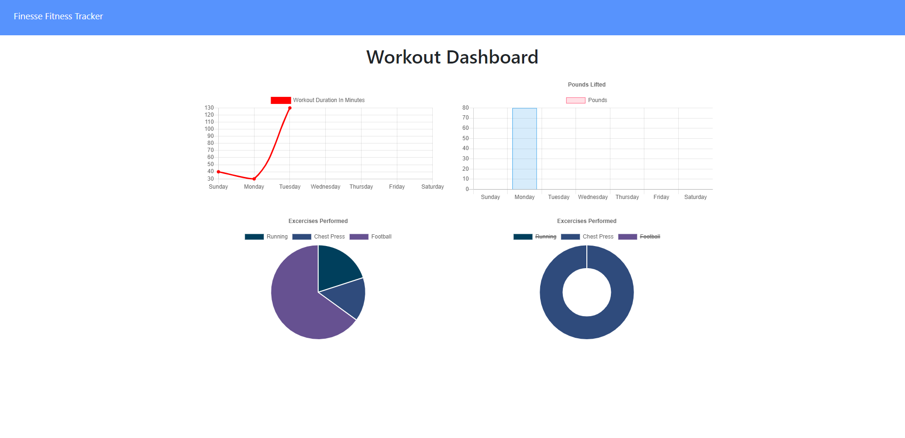
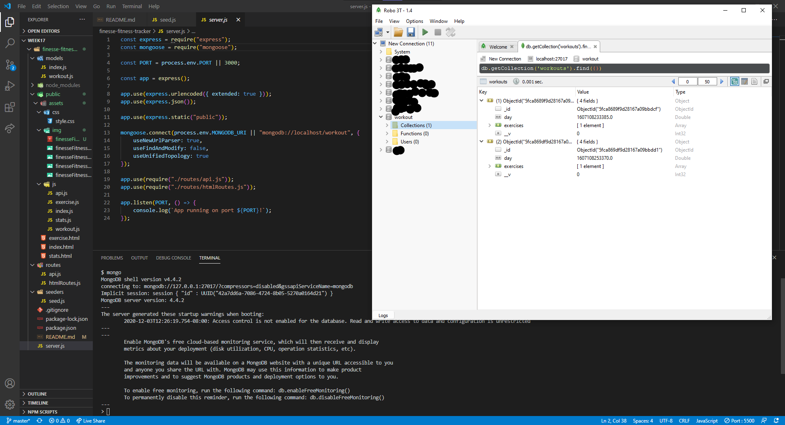
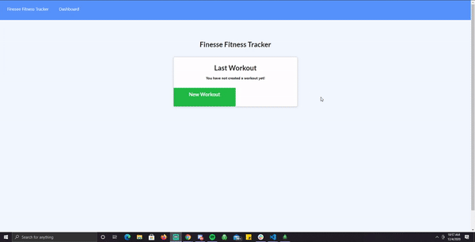

# Finesse Fitness Tracker
Tracking Your Fitness

## Table of Contents
1. [ Description ](#desc)
2. [ Installation ](#install)
3. [ Usage ](#usage)
4. [ License ](#lic)
5. [ Questions](#questions)
6. [ Credits ](#credits)
    

## 1. Description
Already Provided with The Front End of the code, This application is to create a Nosql, Workout Tracker; with a Mongo Database/Schema, and the utilization of Express Handle Bars routes.
    

## 2. Installation
npm Install, npm start, node server.js, nodemon server.js
    

## 3. Usage
Ability to keep Track of Your Recorded Workouts
    

## 4. License
MIT
 

## 5. Questions
Please visit my GitHub to view all of my work:

https://www.github.com/CdmMandalorian 

Contact me at: egalindounited@gmail.com

## LIVE LINK: 
<a href="https://git.heroku.com/track-finesse-fitness.git">Finesse Fitness Tracker</a>

## Screenshots of Finesse Fitness Tracker:

## LIVE VIDEO GIF's OF Finesse Fitness Tracker:

## Repository:  
[Finesse Fitness Tracker](https://github.com/CdmMandalorian/)  

  
## Portfolio:  
[Armando Galindo Portfolio](https://cdmmandalorian.github.io/Armando-E-Galindo-Portfolio/)

## Credits:    
HTML 5  
CSS    
BootStrap                      
Javascript                   
Node      
Express Handlebars   
Mongoose Db       
Mongoose Schema          
